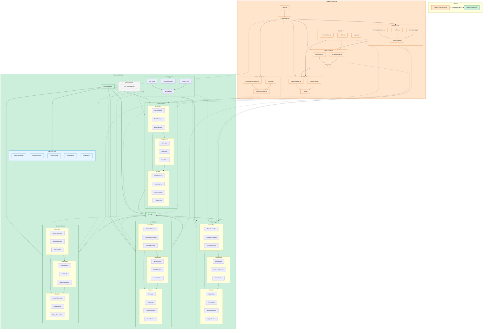

```mermaid
flowchart TB
    subgraph Legend
        Current[Current Implementation] --> |Migration Path| Target[Target Architecture]
        classDef current fill:#FFE5CC,stroke:#D4641A
        classDef target fill:#CCEFDC,stroke:#006400
        classDef service fill:#E6F5FF,stroke:#0077CC
        classDef external fill:#F5F5F5,stroke:#999999,stroke-dasharray: 5 5
        class Current current
        class Target target
    end

    %% Current Architecture
    subgraph CurrentArch[Current Architecture]
        direction TB
        C_Main[Main.gd] --> C_GameState[GameState.gd]
        
        subgraph C_Card[Card System]
            direction TB
            C_Card_Card[Card.gd] 
            C_CardDB[CardDatabase.gd] --> C_Card_Card
            C_CardDisplay[CardDisplay.gd] --> C_Card_Card
        end

        subgraph C_Player[Player System]
            direction TB
            C_Player_Base[Player.gd]
            C_CorpPlayer[CorpPlayer.gd] --> C_Player_Base
            C_RunnerPlayer[RunnerPlayer.gd] --> C_Player_Base
        end

        subgraph C_World[World System]
            direction TB
            C_TerritoryMap[TerritoryMap.gd]
            C_TerritoryController[TerritoryController.gd] --> C_TerritoryMap
            C_HexTile[HexTile.gd] --> C_TerritoryMap
            C_GameBoard[GameBoard.gd] --> C_TerritoryMap
        end

        subgraph C_Network[Network System]
            direction TB
            C_NetworkManager[NetworkManager.gd]
            C_HttpNetworkManager[HttpNetworkManager.gd] --> C_NetworkManager
            C_Server[Server.gd] --> C_NetworkManager
        end

        subgraph C_UI[UI System]
            direction TB
            C_DeckBuilder[DeckBuilder.gd]
            C_Lobby[Lobby.gd]
            C_Login[Login.gd]
        end

        C_GameState --> C_Card
        C_GameState --> C_Player
        C_GameState --> C_World
        C_GameState --> C_Network
        C_Player --> C_Card
        C_World --> C_Player
        C_UI --> C_Player
        C_UI --> C_Card
    end
    
    classDef current fill:#FFE5CC,stroke:#D4641A
    class CurrentArch,C_Main,C_GameState,C_Card,C_Player,C_World,C_Network,C_UI,C_Card_Card,C_CardDB,C_CardDisplay,C_Player_Base,C_CorpPlayer,C_RunnerPlayer,C_TerritoryMap,C_TerritoryController,C_HexTile,C_GameBoard,C_NetworkManager,C_HttpNetworkManager,C_Server,C_DeckBuilder,C_Lobby,C_Login current
    
    %% Target Architecture (ECS + MVC)
    subgraph TargetArch[Target Architecture]
        direction TB
        T_GameManager[GameManager] --> T_EventBus[EventBus]
        
        subgraph T_ServiceLayer[Service Layer]
            direction TB
            T_ServiceManager[ServiceManager]
            T_LoggingService[LoggingService]
            T_ConfigService[ConfigService]
            T_AssetService[AssetService]
            T_TimeService[TimeService]
        end
        
        subgraph T_CardSystem[Card System]
            direction TB
            
            subgraph T_Card_Models[Models]
                T_CardResource[CardResource] 
                T_CardInstance[CardInstance] 
                T_DeckResource[DeckResource]
                T_CardFactory[CardFactory]
            end
            
            subgraph T_Card_Components[Components]
                T_CardView[CardView]
                T_HandView[HandView]
                T_DeckView[DeckView]
            end
            
            subgraph T_Card_Controllers[Controllers]
                T_CardManager[CardManager]
                T_DeckManager[DeckManager]
                T_ZoneManager[ZoneManager]
            end
            
            T_Card_Controllers --> T_Card_Models
            T_Card_Components --> T_Card_Models
            T_Card_Controllers --> T_Card_Components
        end
        
        subgraph T_PlayerSystem[Player System]
            direction TB
            
            subgraph T_Player_Models[Models]
                T_PlayerData[PlayerData]
                T_PlayerState[PlayerState]
                T_Identity[IdentityResource]
                T_PlayerFactory[PlayerFactory]
            end
            
            subgraph T_Player_Components[Components]
                T_PlayerView[PlayerView]
                T_ResourceCounter[ResourceCounter]
                T_ActionButton[ActionButton]
            end
            
            subgraph T_Player_Controllers[Controllers]
                T_PlayerController[PlayerController]
                T_ResourceManager[ResourceManager]
                T_FactionManager[FactionManager]
            end
            
            T_Player_Controllers --> T_Player_Models
            T_Player_Components --> T_Player_Models
            T_Player_Controllers --> T_Player_Components
        end
        
        subgraph T_WorldSystem[World System]
            direction TB
            
            subgraph T_World_Models[Models]
                T_Territory[Territory]
                T_WorldMap[WorldMap]
                T_Location[LocationInstance]
                T_WorldFactory[WorldFactory]
            end
            
            subgraph T_World_Components[Components]
                T_TerritoryView[TerritoryView]
                T_WorldMapView[WorldMapView]
                T_LocationView[LocationView]
            end
            
            subgraph T_World_Controllers[Controllers]
                T_TerritoryManager[TerritoryManager]
                T_ProceduralGen[ProceduralGenerator]
                T_MissionManager[MissionManager]
            end
            
            T_World_Controllers --> T_World_Models
            T_World_Components --> T_World_Models
            T_World_Controllers --> T_World_Components
        end
        
        subgraph T_NetworkSystem[Network System]
            direction TB
            
            subgraph T_Network_Models[Models]
                T_NetworkMessage[NetworkMessage]
                T_GameSession[GameSession]
                T_PlayerConnection[PlayerConnection]
            end
            
            subgraph T_Network_Components[Components]
                T_ConnectionUI[ConnectionUI]
                T_LobbyUI[LobbyUI]
                T_NetworkDebugUI[NetworkDebugUI]
            end
            
            subgraph T_Network_Controllers[Controllers]
                T_NetworkManager[NetworkManager]
                T_SessionManager[SessionManager]
                T_RPCHandler[RPCHandler]
            end
            
            T_Network_Controllers --> T_Network_Models
            T_Network_Components --> T_Network_Models
            T_Network_Controllers --> T_Network_Components
        end
        
        subgraph T_TestSystem[Test System]
            direction TB
            T_UnitTests[Unit Tests]
            T_IntegrationTests[Integration Tests]
            T_SystemTests[System Tests]
            T_TestHelpers[Test Helpers]
            
            T_UnitTests --> T_TestHelpers
            T_IntegrationTests --> T_TestHelpers
            T_SystemTests --> T_TestHelpers
        end
        
        %% External Design Tools
        External[External Design Tools] -.-> T_CardSystem
        External[External Design Tools] -.-> T_PlayerSystem
        External[External Design Tools] -.-> T_WorldSystem
        
        %% Core Dependencies
        T_GameManager --> T_CardSystem
        T_GameManager --> T_PlayerSystem
        T_GameManager --> T_WorldSystem
        T_GameManager --> T_NetworkSystem
        T_GameManager --> T_ServiceLayer
        
        %% Event-Based Communication
        T_EventBus -.-> T_CardSystem
        T_EventBus -.-> T_PlayerSystem
        T_EventBus -.-> T_WorldSystem
        T_EventBus -.-> T_NetworkSystem
        
        %% System Interdependencies
        T_CardSystem --> T_EventBus
        T_PlayerSystem --> T_EventBus
        T_WorldSystem --> T_EventBus
        T_NetworkSystem --> T_EventBus
        
        %% Test System Dependencies
        T_TestSystem -.-> T_CardSystem
        T_TestSystem -.-> T_PlayerSystem
        T_TestSystem -.-> T_WorldSystem
        T_TestSystem -.-> T_NetworkSystem
    end
    
    subgraph External[External Tools]
        DSL_Design[DSL Specifications]
    end
    
    classDef target fill:#CCEFDC,stroke:#006400
    classDef service fill:#E6F5FF,stroke:#0077CC
    class TargetArch,T_GameManager,T_EventBus,T_CardSystem,T_PlayerSystem,T_WorldSystem,T_NetworkSystem,T_TestSystem target
    class T_ServiceLayer,T_ServiceManager,T_LoggingService,T_ConfigService,T_AssetService,T_TimeService service
    class External,DSL_Design,External external
    
    %% Migration Path
    C_Card -.-> T_CardSystem
    C_Player -.-> T_PlayerSystem
    C_World -.-> T_WorldSystem
    C_Network -.-> T_NetworkSystem
    C_UI -.-> T_PlayerSystem
    C_UI -.-> T_CardSystem
    C_GameState -.-> T_GameManager
    C_GameState -.-> T_EventBus
```

