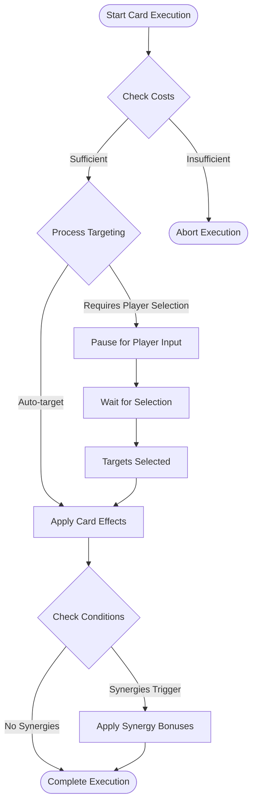
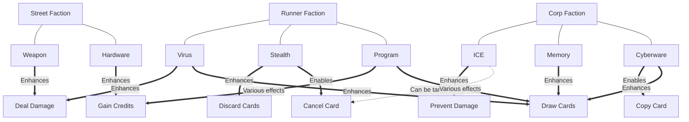
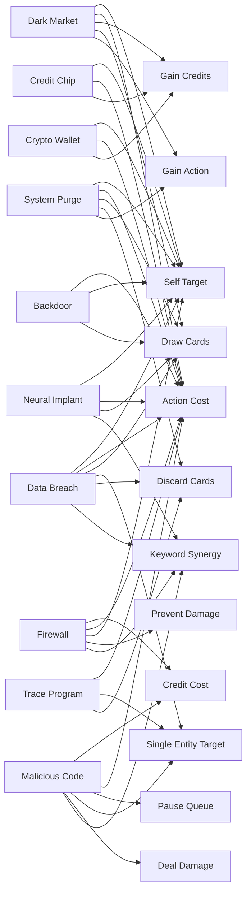
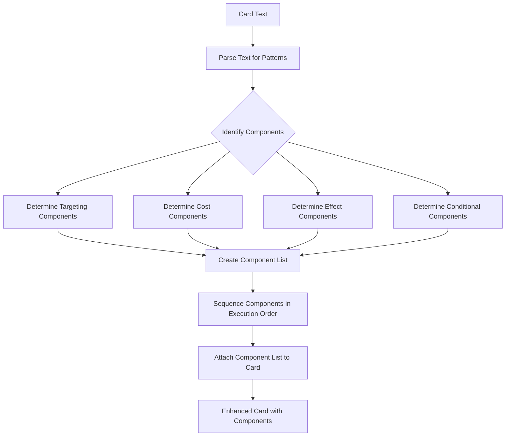

# Card Component System Architecture

This document visualizes the relationships between card mechanics, keywords, and components in our Cyberpunk deck-builder game.

## Component Type Hierarchy

```mermaid
classDiagram
    Component <|-- TargetingComponent
    Component <|-- CostComponent
    Component <|-- EffectComponent
    Component <|-- ConditionalComponent
    Component <|-- ControlFlowComponent
    Component <|-- InformationComponent
    
    TargetingComponent <|-- SingleEntityTarget
    TargetingComponent <|-- MultiEntityTarget
    TargetingComponent <|-- SelfTarget
    
    CostComponent <|-- CreditCost
    CostComponent <|-- ActionCost
    CostComponent <|-- KeywordRequirement
    
    EffectComponent <|-- GainCredits
    EffectComponent <|-- DealDamage
    EffectComponent <|-- PreventDamage
    EffectComponent <|-- DrawCards
    EffectComponent <|-- DiscardCards
    EffectComponent <|-- GainAction
    
    ConditionalComponent <|-- KeywordSynergy
    
    ControlFlowComponent <|-- PauseQueue
    ControlFlowComponent <|-- CancelCard
    
    InformationComponent <|-- RevealCard
    InformationComponent <|-- ScanEntity
    
    class Component {
        +type: string
        +apply(context: GameContext): void
    }
    
    class TargetingComponent {
        <<abstract>>
    }
    
    class CostComponent {
        <<abstract>>
    }
    
    class EffectComponent {
        <<abstract>>
    }
    
    class ConditionalComponent {
        <<abstract>>
    }
    
    class ControlFlowComponent {
        <<abstract>>
    }
    
    class InformationComponent {
        <<abstract>>
    }
    
    class SingleEntityTarget {
        +targetType: string
        +allowTargetSelection: boolean
        +filter?: function
    }
    
    class MultiEntityTarget {
        +targetType: string
        +maxTargets: number
        +filter?: function
    }
    
    class SelfTarget {
    }
    
    class CreditCost {
        +amount: number
    }
    
    class ActionCost {
        +amount: number
    }
    
    class KeywordRequirement {
        +keyword: CardKeyword
        +count: number
        +location: string
    }
    
    class GainCredits {
        +amount: number
    }
    
    class DealDamage {
        +amount: number
    }
    
    class PreventDamage {
        +amount: number
    }
    
    class DrawCards {
        +amount: number
    }
    
    class DiscardCards {
        +amount: number
        +random: boolean
    }
    
    class GainAction {
        +amount: number
    }
    
    class KeywordSynergy {
        +keyword: CardKeyword
        +targetComponent: string
        +bonusAmount: number
    }
    
    class PauseQueue {
        +message: string
    }
    
    class CancelCard {
        +targetCardIndex?: number
        +targetCardCondition?: function
    }
    
    class RevealCard {
    }
    
    class ScanEntity {
        +revealFullInfo: boolean
    }
```

## Card Execution Flow

## Keyword Synergy Network

## Component Usage in Cards

## Text-to-Component Mapping Process

