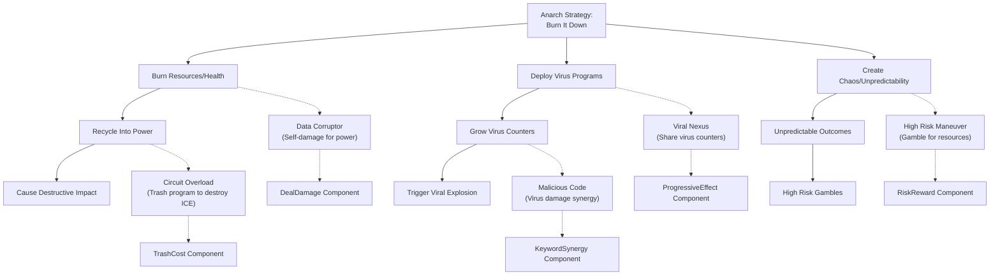
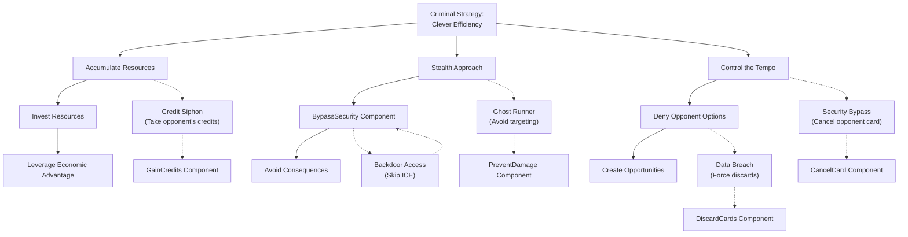
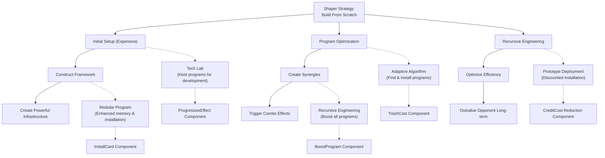
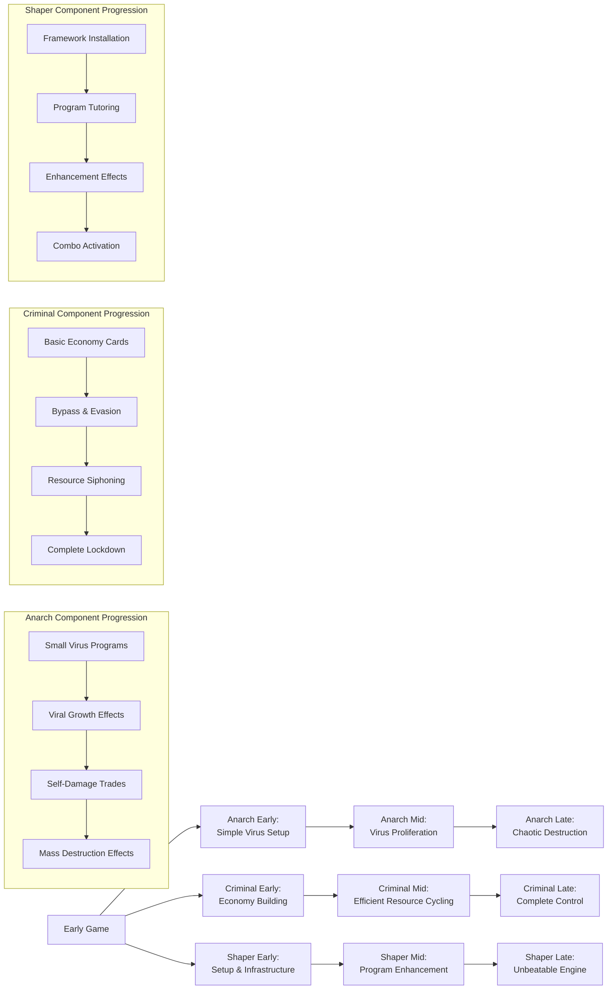

# Component Relationship Matrix

This document visualizes the relationships between components, keywords, factions, and game mechanics in our Cyberpunk deck-builder.

## Runner Faction Identity Mechanics Matrix

Each runner faction has distinctive gameplay mechanics that align with their identity. This matrix maps the core components and mechanics that define each faction's unique playstyle.

| Faction | Core Identity | Primary Mechanics | Secondary Mechanics | Risk Profile |
|---------|---------------|-------------------|---------------------|--------------|
| **Anarch (Red)** | Destructive, recycle what you broke, powerful effects with high risk | DealDamage, TrashCost, RiskReward | ProgressiveEffect (viruses), RecycleCard | High Risk, High Reward |
| **Criminal (Blue)** | Efficient, stealthy, flexible, resource-focused | GainCredits, BypassSecurity, CancelCard | StealResources, Evasion, Connections | Medium Risk, Consistent Reward |
| **Shaper (Green)** | Builders, engineers, grows over time, powerful with setup | InstallCard, BoostProgram, ComboEffect | DrawCards, ProgressiveEffect, ModifyCard | Low Risk, Delayed High Reward |

## Component-Keyword Relationship Matrix by Faction

### Anarch Keywords

| Component       | Virus        | DDoS         | Daemon        | Rootkit      | Fragger      |
|-----------------|--------------|--------------|---------------|--------------|--------------|
| DealDamage      | ✓✓✓          | ✓            | ✓✓            | ✓            | ✓✓✓          |
| TrashCost       | ✓            | ✓✓           | ✓✓✓           | ✓            | ✓            |
| RiskReward      | ✓✓           | ✓✓✓          | ✓✓            | ✓✓           | ✓✓           |
| RecycleCard     | ✓✓           | ✓            | ✓✓            | ✓✓✓          | -            |
| ProgressiveEffect| ✓✓✓         | ✓✓           | ✓             | ✓✓           | -            |
| DiscardCards    | ✓            | ✓✓           | -             | ✓✓✓          | ✓            |

### Criminal Keywords

| Component       | Stealth      | Run          | Connection    | Bypass       | Siphon       |
|-----------------|--------------|--------------|---------------|--------------|--------------|
| GainCredits     | ✓            | ✓✓           | ✓✓✓           | ✓            | ✓✓✓          |
| BypassSecurity  | ✓✓✓          | ✓✓           | ✓             | ✓✓✓          | -            |
| CancelCard      | ✓✓           | ✓            | ✓             | ✓✓           | -            |
| RedirectEffect  | ✓            | ✓✓           | ✓             | ✓✓✓          | ✓            |
| TagEntity       | -            | ✓            | ✓✓✓           | -            | ✓✓           |
| GainAction      | ✓            | ✓✓           | ✓✓            | ✓            | ✓            |

### Shaper Keywords

| Component       | Program      | Builder      | Memory        | Mod          | Breaker      |
|-----------------|--------------|--------------|---------------|--------------|--------------|
| InstallCard     | ✓✓✓          | ✓✓           | ✓             | ✓✓           | ✓✓           |
| BoostProgram    | ✓✓           | ✓✓✓          | ✓✓            | ✓✓           | ✓✓✓          |
| ComboEffect     | ✓            | ✓✓✓          | ✓✓            | ✓✓           | ✓            |
| DrawCards       | ✓            | ✓            | ✓✓✓           | ✓            | ✓            |
| ModifyCard      | ✓✓           | ✓✓           | ✓             | ✓✓✓          | ✓✓           |
| PreventDamage   | -            | ✓            | ✓✓            | ✓✓           | ✓            |

## Faction-Component Risk/Reward Profile

This matrix visualizes how each faction balances risk and reward across different component types.

| Component Type | Anarch (Red) | Criminal (Blue) | Shaper (Green) |
|----------------|--------------|-----------------|----------------|
| **Cost Components** |
| CreditCost     | Medium-High  | High            | Medium         |
| ActionCost     | Medium       | Low-Medium      | High           |
| TrashCost      | Low          | High            | Medium-High    |
| HealthCost     | Low          | Very High       | Very High      |
| **Effect Components** |
| DealDamage     | Low (High value) | Medium       | High (Low value) |
| GainCredits    | High         | Low (High value) | Medium        |
| DrawCards      | Medium       | Medium          | Low (High value) |
| GainAction     | High         | Medium (High value) | High       |
| **Control Components** |
| CancelCard     | High         | Low             | Medium        |
| RedirectEffect | Medium       | Low             | High          |
| ModifyCardInQueue | High      | Medium          | Low           |

Legend:
- For costs: Low = cheapest, High = most expensive
- For effects: Low = best value, High = worst value
- For control: Low = most efficient, High = least efficient

## Component Interaction Diagram: Faction-Specific Play Patterns

```mermaid
flowchart TD
    %% Component Categories by Faction
    AnarchCost["Anarch Costs\n(Health, Risk, Trash)"]
    CriminalCost["Criminal Costs\n(Credits, Efficiency)"]
    ShaperCost["Shaper Costs\n(Time, Setup)"]
    
    AnarchEffect["Anarch Effects\n(Damage, Destruction)"]
    CriminalEffect["Criminal Effects\n(Economy, Evasion)"]
    ShaperEffect["Shaper Effects\n(Construction, Combo)"]
    
    %% Main execution flow by faction
    AnarchCost --> |"Risk taken"| AnarchEffect
    AnarchEffect --> |"Creates chaos"| GameState1["Destabilized Game State"]
    GameState1 --> |"Benefits from chaos"| AnarchAdvantage["Anarch Advantage"]
    
    CriminalCost --> |"Efficiency optimized"| CriminalEffect
    CriminalEffect --> |"Creates opportunities"| GameState2["Resource Advantage"]
    GameState2 --> |"Exploits weaknesses"| CriminalAdvantage["Criminal Advantage"]
    
    ShaperCost --> |"Setup completed"| ShaperEffect
    ShaperEffect --> |"Creates infrastructure"| GameState3["Enhanced Capabilities"]
    GameState3 --> |"Leverages technology"| ShaperAdvantage["Shaper Advantage"]
    
    %% Example component execution flows by faction
    subgraph "Anarch Pattern: High Risk/High Reward"
        TrashCard["Trash Card Cost"] --> RiskDamage["Risk Self-Damage"]
        RiskDamage --> DestructiveEffect["Destructive Effect"]
        DestructiveEffect --> RecycleDestroyed["Recycle Destroyed Resources"]
        RecycleDestroyed --> |"If successful"| MassiveGain["Massive Gain"]
    end
    
    subgraph "Criminal Pattern: Efficiency and Control"
        CreditInvestment["Credit Investment"] --> StealthBypass["Stealth/Bypass"]
        StealthBypass --> ResourceExtraction["Resource Extraction"]
        ResourceExtraction --> ActionGain["Action Gain"]
        ActionGain --> RepeatCycle["Repeat Efficient Cycle"]
    end
    
    subgraph "Shaper Pattern: Build and Execute"
        SetupPhase["Setup Phase (High Cost)"] --> BuildInfrastructure["Build Infrastructure"]
        BuildInfrastructure --> EnhanceComponents["Enhance Components"]
        EnhanceComponents --> ComboActivation["Combo Activation"]
        ComboActivation --> |"Once built"| PowerfulOutcome["Powerful Outcome"]
    end
```

## Faction Archetypes: Component Strategy Maps

### Anarch (Red): Destructive Virus Runner

A high-risk, high-reward strategy focused on virus proliferation, destruction, and chaotic effects.

### Criminal (Blue): Efficient Resource Specialist

A consistent, efficient strategy focused on resource accumulation, stealth, and control through clever preparation.

### Shaper (Green): Engineering Builder

A methodical, long-term strategy focused on building powerful infrastructure and combos for overwhelming late-game advantage.

## Component Progression Timeline by Faction

This diagram illustrates how each faction's components build upon each other throughout a game:

## Faction Design Principles: Component Guidelines

The design of components for each faction follows these guiding principles to ensure mechanical and thematic alignment:

### Anarch (Red):
- **Cost Structure**: Lower credit costs, higher risk/health/resource costs
- **Effect Pattern**: Front-loaded powerful effects with drawbacks or volatility
- **Synergy Pattern**: Virus proliferation, recycling destruction, chaos multiplication
- **Tempo Profile**: Fast initial impact, with potential for exponential growth if unchecked

### Criminal (Blue):
- **Cost Structure**: Moderate to high credit costs, lower action costs
- **Effect Pattern**: Consistent, predictable, and efficient effects
- **Synergy Pattern**: Resource feedback loops, efficient combinations, control reinforcement
- **Tempo Profile**: Steady acceleration model, with consistent incremental gains

### Shaper (Green):
- **Cost Structure**: High initial costs (time/actions/credits), diminishing costs over time
- **Effect Pattern**: Setup phase followed by powerful payoffs
- **Synergy Pattern**: Combo-oriented, with components enhancing each other multiplicatively
- **Tempo Profile**: Slow start with exponential growth in late game