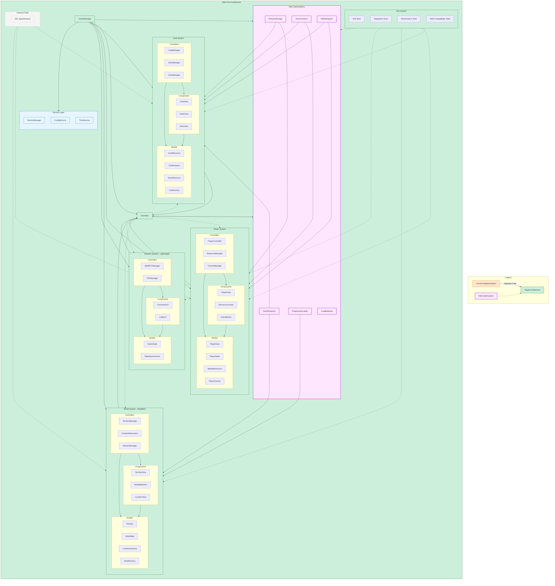

```mermaid
flowchart TB
    subgraph Legend
        Current[Current Implementation] --> |Migration Path| Target[Target Architecture]
        classDef current fill:#FFE5CC,stroke:#D4641A
        classDef target fill:#CCEFDC,stroke:#006400
        classDef service fill:#E6F5FF,stroke:#0077CC
        classDef webopt fill:#FFE6FF,stroke:#9932CC,stroke-width:2
        classDef external fill:#F5F5F5,stroke:#999999,stroke-dasharray: 5 5
        class Current current
        class Target target
        WebOpt[Web Optimization] -.-> Target
        class WebOpt webopt
    end

    %% Target Architecture (ECS + MVC) with Web Optimizations
    subgraph TargetArch[Web-First Architecture]
        direction TB
        T_GameManager[GameManager] --> T_EventBus[EventBus]
        
        subgraph T_WebOptimizations[Web Optimizations]
            direction TB
            T_AssetStreamer[AssetStreamer]
            T_ProgressiveLoader[ProgressiveLoader]
            T_LocalStorage[BrowserStorage]
            T_TouchControls[TouchControls]
            T_LoadBalancer[LoadBalancer]
            T_OfflineSupport[OfflineSupport]
        end
        
        subgraph T_ServiceLayer[Service Layer]
            direction TB
            T_ServiceManager[ServiceManager]
            T_ConfigService[ConfigService]
            T_TimeService[TimeService]
        end
        
        subgraph T_CardSystem[Card System]
            direction TB
            
            subgraph T_Card_Models[Models]
                T_CardResource[CardResource] 
                T_CardInstance[CardInstance] 
                T_DeckResource[DeckResource]
                T_CardFactory[CardFactory]
            end
            
            subgraph T_Card_Components[Components]
                T_CardView[CardView]
                T_HandView[HandView]
                T_DeckView[DeckView]
            end
            
            subgraph T_Card_Controllers[Controllers]
                T_CardManager[CardManager]
                T_DeckManager[DeckManager]
                T_ZoneManager[ZoneManager]
            end
            
            T_Card_Controllers --> T_Card_Models
            T_Card_Components --> T_Card_Models
            T_Card_Controllers --> T_Card_Components
        end
        
        subgraph T_PlayerSystem[Player System]
            direction TB
            
            subgraph T_Player_Models[Models]
                T_PlayerData[PlayerData]
                T_PlayerState[PlayerState]
                T_Identity[IdentityResource]
                T_PlayerFactory[PlayerFactory]
            end
            
            subgraph T_Player_Components[Components]
                T_PlayerView[PlayerView]
                T_ResourceCounter[ResourceCounter]
                T_ActionButton[ActionButton]
            end
            
            subgraph T_Player_Controllers[Controllers]
                T_PlayerController[PlayerController]
                T_ResourceManager[ResourceManager]
                T_FactionManager[FactionManager]
            end
            
            T_Player_Controllers --> T_Player_Models
            T_Player_Components --> T_Player_Models
            T_Player_Controllers --> T_Player_Components
        end
        
        subgraph T_WorldSystem[World System - Simplified]
            direction TB
            
            subgraph T_World_Models[Models]
                T_Territory[Territory]
                T_WorldMap[WorldMap]
                T_Location[LocationInstance]
                T_WorldFactory[WorldFactory]
            end
            
            subgraph T_World_Components[Components]
                T_TerritoryView[TerritoryView]
                T_WorldMapView[WorldMapView]
                T_LocationView[LocationView]
            end
            
            subgraph T_World_Controllers[Controllers]
                T_TerritoryManager[TerritoryManager]
                T_ChunkedGenerator[ChunkedGenerator]
                T_MissionManager[MissionManager]
            end
            
            T_World_Controllers --> T_World_Models
            T_World_Components --> T_World_Models
            T_World_Controllers --> T_World_Components
        end
        
        subgraph T_NetworkSystem[Network System - Lightweight]
            direction TB
            
            subgraph T_Network_Models[Models]
                T_GameState[GameState]
                T_StateSynchronizer[StateSynchronizer]
            end
            
            subgraph T_Network_Components[Components]
                T_ConnectionUI[ConnectionUI]
                T_LobbyUI[LobbyUI]
            end
            
            subgraph T_Network_Controllers[Controllers]
                T_WebRTCManager[WebRTCManager]
                T_P2PManager[P2PManager]
            end
            
            T_Network_Controllers --> T_Network_Models
            T_Network_Components --> T_Network_Models
            T_Network_Controllers --> T_Network_Components
        end
        
        subgraph T_TestSystem[Test System]
            direction TB
            T_UnitTests[Unit Tests]
            T_IntegrationTests[Integration Tests]
            T_PerformanceTests[Performance Tests]
            T_WebCompatTests[Web Compatibility Tests]
        end
        
        %% External Design Tools
        External[External Design Tools] -.-> T_CardSystem
        External[External Design Tools] -.-> T_PlayerSystem
        External[External Design Tools] -.-> T_WorldSystem
        
        %% Core Dependencies with Web Optimizations
        T_GameManager --> T_CardSystem
        T_GameManager --> T_PlayerSystem
        T_GameManager --> T_WorldSystem
        T_GameManager --> T_NetworkSystem
        T_GameManager --> T_ServiceLayer
        T_GameManager --> T_WebOptimizations
        
        %% Web Optimization Integration
        T_AssetStreamer --> T_CardSystem
        T_AssetStreamer --> T_WorldSystem
        T_ProgressiveLoader --> T_WorldSystem
        T_LocalStorage --> T_PlayerSystem
        T_LocalStorage --> T_CardSystem
        T_TouchControls --> T_PlayerSystem
        T_TouchControls --> T_CardSystem
        T_OfflineSupport --> T_PlayerSystem
        T_OfflineSupport --> T_CardSystem
        
        %% Event-Based Communication
        T_EventBus -.-> T_CardSystem
        T_EventBus -.-> T_PlayerSystem
        T_EventBus -.-> T_WorldSystem
        T_EventBus -.-> T_NetworkSystem
        T_EventBus -.-> T_WebOptimizations
        
        %% System Interdependencies
        T_CardSystem --> T_EventBus
        T_PlayerSystem --> T_EventBus
        T_WorldSystem --> T_EventBus
        T_NetworkSystem --> T_EventBus
        T_WebOptimizations --> T_EventBus
        
        %% Test System Dependencies
        T_TestSystem -.-> T_CardSystem
        T_TestSystem -.-> T_PlayerSystem
        T_TestSystem -.-> T_WorldSystem
        T_TestSystem -.-> T_NetworkSystem
        T_TestSystem -.-> T_WebOptimizations
    end
    
    subgraph External[External Tools]
        DSL_Design[DSL Specifications]
    end
    
    classDef target fill:#CCEFDC,stroke:#006400
    classDef service fill:#E6F5FF,stroke:#0077CC
    classDef webopt fill:#FFE6FF,stroke:#9932CC,stroke-width:2
    class TargetArch,T_GameManager,T_EventBus,T_CardSystem,T_PlayerSystem,T_WorldSystem,T_NetworkSystem,T_TestSystem target
    class T_ServiceLayer,T_ServiceManager,T_ConfigService,T_TimeService service
    class External,DSL_Design external
    class T_WebOptimizations,T_AssetStreamer,T_ProgressiveLoader,T_LocalStorage,T_TouchControls,T_LoadBalancer,T_OfflineSupport webopt
```
