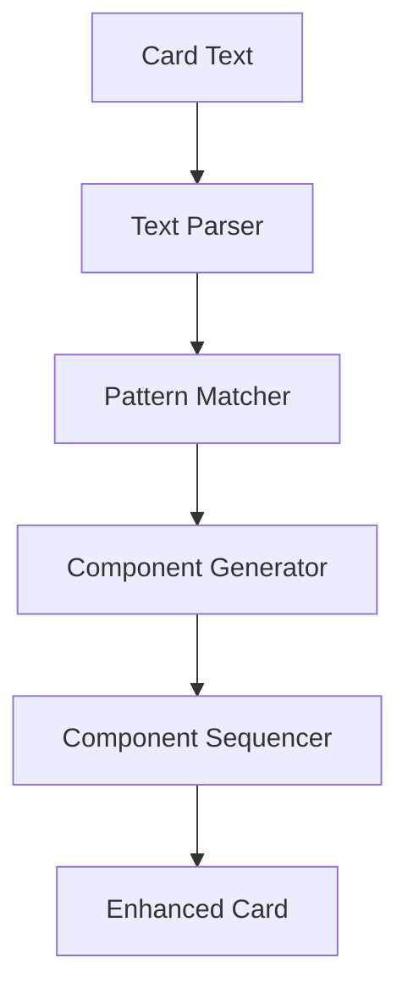

# Text-to-Component Mapping System

This document outlines the design and implementation plan for the text-to-component mapping system, which will automatically generate card components from card descriptions.

## System Overview

The text-to-component mapping system will parse card text, identify patterns that correspond to game mechanics, and generate the appropriate components in the correct execution order.



## Pattern Definition System

We'll define a set of pattern rules in a structured format that maps text patterns to component configurations:

```typescript
interface TextPattern {
  pattern: string | RegExp;  // The text pattern to match
  components: ComponentGeneratorConfig[];  // Components to generate when pattern matches
  precedence: number;  // For handling overlapping patterns
}

interface ComponentGeneratorConfig {
  type: string;  // Component type to generate
  parameterMap: {  // Maps captured values from the pattern to component parameters
    [paramName: string]: string | number | ((captures: any) => any);
  };
  position: number;  // Position in execution sequence
}
```

## Example Pattern Definitions

```javascript
const patterns = [
  {
    pattern: /Gain (\d+) credits?/i,
    components: [
      {
        type: 'SelfTarget',
        parameterMap: {},
        position: 0
      },
      {
        type: 'GainCredits',
        parameterMap: {
          amount: (captures) => parseInt(captures[1])
        },
        position: 1
      }
    ],
    precedence: 1
  },
  {
    pattern: /Deal (\d+) damage to (a|an|the) (opponent|threat)/i,
    components: [
      {
        type: 'PauseQueue',
        parameterMap: {
          message: (captures) => `Select a target for ${captures[1]} damage`
        },
        position: 0
      },
      {
        type: 'SingleEntityTarget',
        parameterMap: {
          targetType: (captures) => captures[3].toLowerCase(),
          allowTargetSelection: (captures) => captures[3].toLowerCase() === 'threat'
        },
        position: 1
      },
      {
        type: 'DealDamage',
        parameterMap: {
          amount: (captures) => parseInt(captures[1])
        },
        position: 2
      }
    ],
    precedence: 2
  },
  {
    pattern: /If you have another (\w+) (card |)in play/i,
    components: [
      {
        type: 'KeywordSynergy',
        parameterMap: {
          keyword: (captures) => captures[1],
          // targetComponent and bonusAmount would be determined from context
          targetComponent: 'placeholder',
          bonusAmount: 1
        },
        position: 10  // Higher position to ensure it comes after the effects it modifies
      }
    ],
    precedence: 3
  }
];
```

## Implementation Plan

### 1. Pattern Matching Engine

```typescript
class PatternMatchingEngine {
  patterns: TextPattern[];
  
  constructor(patterns: TextPattern[]) {
    this.patterns = patterns.sort((a, b) => b.precedence - a.precedence);
  }
  
  findMatches(text: string): PatternMatch[] {
    const matches: PatternMatch[] = [];
    
    // Process each pattern
    for (const pattern of this.patterns) {
      const regex = pattern.pattern instanceof RegExp 
        ? pattern.pattern 
        : new RegExp(pattern.pattern, 'i');
        
      const match = text.match(regex);
      if (match) {
        matches.push({
          pattern,
          match,
          index: match.index || 0,
          length: match[0].length
        });
      }
    }
    
    // Sort matches by position in text
    return matches.sort((a, b) => a.index - b.index);
  }
}
```

### 2. Component Generator

```typescript
class ComponentGenerator {
  generateComponents(matches: PatternMatch[]): Component[] {
    const componentConfigs: ComponentGeneratorConfig[] = [];
    
    // Collect all component configs from matches
    for (const match of matches) {
      for (const config of match.pattern.components) {
        // Clone the config to avoid modifying the original
        const configCopy = { ...config };
        
        // Process parameter mapping
        const processedParams: any = {};
        for (const [paramName, paramValue] of Object.entries(config.parameterMap)) {
          if (typeof paramValue === 'function') {
            processedParams[paramName] = paramValue(match.match);
          } else {
            processedParams[paramName] = paramValue;
          }
        }
        
        configCopy.processedParams = processedParams;
        componentConfigs.push(configCopy);
      }
    }
    
    // Sort by position for execution order
    componentConfigs.sort((a, b) => a.position - b.position);
    
    // Now create actual component instances
    return componentConfigs.map(config => this.createComponent(config));
  }
  
  createComponent(config: ComponentGeneratorConfig): Component {
    // This would use a factory pattern to create the actual component instance
    switch (config.type) {
      case 'SelfTarget':
        return new SelfTarget();
      case 'SingleEntityTarget':
        return new SingleEntityTarget(
          config.processedParams.targetType,
          config.processedParams.allowTargetSelection
        );
      case 'DealDamage':
        return new DealDamage(config.processedParams.amount);
      // ... other component types
      default:
        throw new Error(`Unknown component type: ${config.type}`);
    }
  }
}
```

### 3. Context-Aware Synergy Resolution

For conditional effects like "If you have another Virus in play, deal 1 more damage", we need context awareness:

```typescript
class SynergyResolver {
  resolveContextualSynergies(components: Component[], text: string): Component[] {
    // Find synergy components
    const synergyComponents = components.filter(
      comp => comp instanceof KeywordSynergy
    ) as KeywordSynergy[];
    
    for (const synergy of synergyComponents) {
      // Find what effect this synergy modifies based on text analysis
      // This is the complex part that requires NLP or pattern matching
      
      // Example: Find which damage component this synergy affects
      if (text.includes(`deal ${synergy.bonusAmount} more damage`)) {
        const damageComponent = components.find(
          comp => comp instanceof DealDamage
        ) as DealDamage;
        
        if (damageComponent) {
          synergy.targetComponent = 'DealDamage';
        }
      }
      
      // Repeat for other effect types...
    }
    
    return components;
  }
}
```

### 4. Card Factory

```typescript
class TextToComponentCardFactory {
  patternEngine: PatternMatchingEngine;
  componentGenerator: ComponentGenerator;
  synergyResolver: SynergyResolver;
  
  constructor() {
    this.patternEngine = new PatternMatchingEngine(patterns);
    this.componentGenerator = new ComponentGenerator();
    this.synergyResolver = new SynergyResolver();
  }
  
  createCardFromText(baseCard: Card, description: string): EnhancedCard {
    // Find pattern matches in the description
    const matches = this.patternEngine.findMatches(description);
    
    // Generate component instances
    let components = this.componentGenerator.generateComponents(matches);
    
    // Resolve contextual synergies
    components = this.synergyResolver.resolveContextualSynergies(components, description);
    
    // Create the enhanced card
    return createCardWithComponents(baseCard, components);
  }
}
```

## Implementation Stages

1. **Phase 1: Basic Pattern Matching**
   - Implement pattern definitions for common effects
   - Create simple pattern matching engine
   - Generate basic components for card effects

2. **Phase 2: Complex Pattern Recognition**
   - Add support for compound sentences
   - Implement nested condition handling
   - Support variable substitution in patterns

3. **Phase 3: Contextual Understanding**
   - Add synergy resolution
   - Implement cross-component references
   - Support contextual parameter determination

4. **Phase 4: Validation & Feedback**
   - Add validation to ensure components match description
   - Provide feedback on pattern matches
   - Highlight discrepancies between text and components

5. **Phase 5: Editor Integration**
   - Create UI for editing patterns
   - Add live preview of component generation
   - Implement auto-suggestion for card text